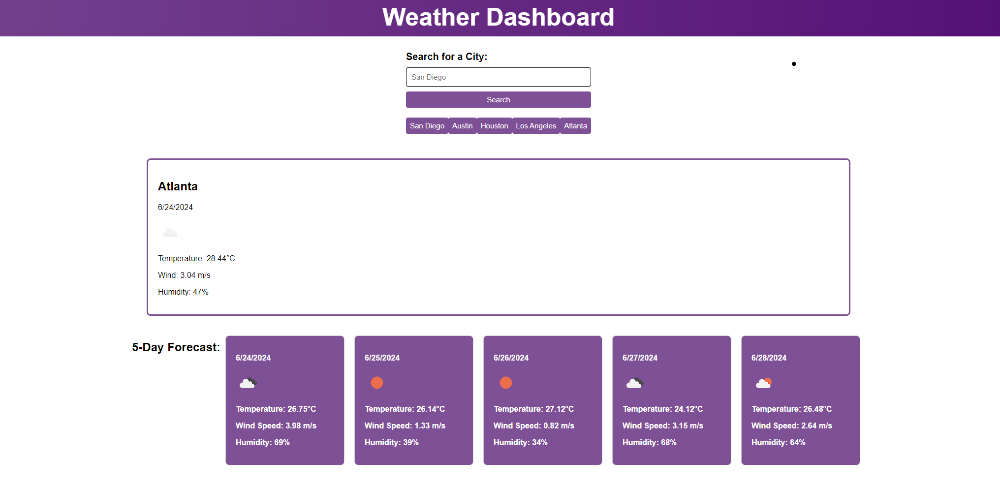

# Weather-Dashboard
This repo is a web app that features dynamically updated weather forecasts.

## Description
This app is a weather dashboard. It allows users to search for the current weather in any given city and also see the 5-day forecast for that city. The application fetches weather data from the OpenWeather API and displays it in user-friendly interface. Users can see their search history on previous searches which are stored in local storage, allowing them to view the weather again for those cities by simply clicking on them instead of searching again.

The purpose of this project was to utilize the Web API tools learned in module 6, primarily focusing on fetching data from third party apis, manipulating the DOM to display data, and using local storage to store user information.

## Usage

To access the deployed website, click the following link: [https://nearias3.github.io/Weather-Dashboard]

 

## Credits

Useful information about coding, including tutorials and guides, were provided by the UT Bootcamp GitLab: [https://git.bootcampcontent.com/University-of-Texas-at-Austin/UTA-VIRT-FSF-PT-05-2024-U-LOLC/].

For this project, I used the OpenWeather API for fetching weather data: [https://openweathermap.org/api], as well as their documentation on using the API: [https://openweathermap.org/forecast5]

I frequently referred to Mozilla's developer tool blogs (MDN Web Docs) for help identifying the correct code and syntax: [https://developer.mozilla.org/en].

I utilized helpful tips and tutorials from coding websites such as: [https://www.geeksforgeeks.org/], [https://coding-boot-camp.github.io], and [https://www.stackoverflow.com].

## License

For all licensing information, please refer to the license included in this repo.
